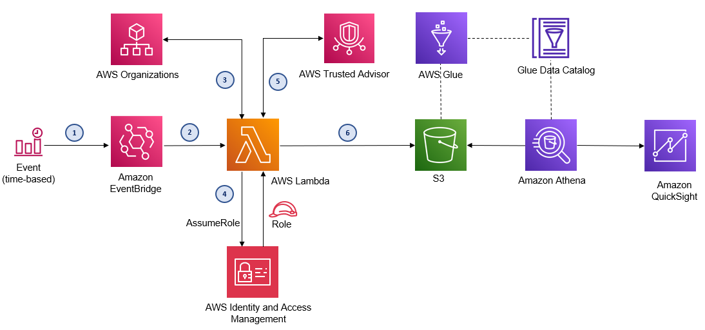

# Centralize AWS Trusted Advisor Recommendations in a Multi-Account Organization

## Solution Overview

This solution enables centralized reporting on AWS Trusted Advisor recommendations by consolidating data from AWS Organization member accounts into a central management or governance account. 

Once deployed, it automates the collection of these recommendations on a predefined schedule from all or selected accounts. The collected data is transformed for analysis and can be queried in Amazon Athena, visualized in QuickSight, or used with any compatible third-party BI tools.

Additionally, users can export the data as CSV files from an S3 bucket, making it accessible for use with custom, or external governance tools for advanced reporting and analytics.

## Solution Architecture

## How it works

1. An EventBridge rule is configured in the central management or governance account to invoke a Lambda function at a pre-configured schedule. For example, daily, weekly or monthly. Defaults to 7 days.

2. A scheduled event in Amazon EventBridge invokes the Lambda function and passes the target S3 location for storing recommendations from Trusted Advisor as arguments to the Lambda function. 
The JSON input to the Lambda function looks something like this,              
   	{\
  	    "S3Bucket": "ta-recommendations-bucket", \
        "S3FolderPath": "ta-recommendations-folder/",\
        "TrustedAdvisorAPIAccessRole": "TrustedAdvisorAPIAccessRole"\
    }

3.  The Lambda function does the following,
    -	Gets the list of member accounts from AWS Organization. 
    -	Assumes preconfigured cross-account role in each member account
    -	Gets Trusted Advisor recommendations from each member account.
    -	Extracts relevant fields from the output, transforms the returned JSON and writes then as CSV in S3. 

4.  The schema for the transformed files in S3 is defined and stored in AWS Glue data catalog.

5.  Amazon QuickSight, or any 3rd Party BI tool such as Tableau or Power BI that is compatible with Athena can be used to query and visualize Trusted Advisor recommendations across all Organizations accounts in a single pane of glass.

## Deploy the Solution

The solution includes the following files
1.	**centralize-org-ta-recs.py** (Python script for the Lambda function)
2.	**CF_Centralize_TA_Recommendations.yaml** (CloudFormation template to deploy the solution)
3.	**CF_Create_TA_API_Access_Role.yaml** (CloudFormation template to create role in Organization accounts using CloudFormation StackSet)

### Prerequisites

1.	Create a new S3 bucket, or use an existing one to serve as the target location for all Trusted Advisor recommendations. Keep the S3 bucket name handy to use when launching the CloudFormation script.
2.	From the management or central governance account, deploy the CloudFormation stack CF_Create_TA_API_Access_Role.yaml in member accounts using CloudFormation StackSet to create an IAM role that will be assumed from the management or central governance account.

### Deploy using CloudFormation
Use the CloudFormation template CF_Centralize_TA_Recommendations.yaml to deploy the solution. 

Provide the following inputs as parameters to CloudFormation when prompted,

**S3BucketName**: Name of the S3 bucket to deliver Cost Explorer forecast results \
**S3FolderPath**: Enter the path to a folder within the S3 bucket for the results file \
        _Default: "CostExplorerForecast/"_ \
**ScheduleExpression**: Interval for the scheduler to run, e.g. every 7 days, or an EventBridge cron job pattern \
        _Default: "rate(7 days)"_ \
**TrustedAdvisorAPIAccessRole**: Name of IAM role created in the perquisite steps \
        _Default: TrustedAdvisorAPIAccessRole_ \
**GlueDBName**:  Name of Glue database \
        _Default: "centralized_ta_recommendations"_ 

The cloud formation script creates the Lambda function along with the necessary permissions for the Lambda role, creates a scheduler in Amazon EventBridge, creates the database and tables in AWS Glue Data Catalog. 

For easy reference to resources created in Glue, or S3, please see the “Outputs” section of the CloudFormation stack you created to deploy the solution. The following keys are created for reference,

_**GlueDatabaseName**:   Name of the Glue Database \
**GlueTableName**:  Name of the Glue Table_ 

## Visualizing Centralized Trusted Advisor Recommendations 

To visualize Trusted Advisor recommendation from all AWS Organizations mender accounts, make sure the Lambda function is invoked at least once by EventBridge. To do a quick test, you may trigger the Lambda function manually from the AWS management console, or via CLI to make sure cost forecasting data is available in S3.  

### Amazon QuickSight
To use QuickSight for visualizing your data, you need to create a new dataset from the Athena table that was created after deploying the solution. For step-by-step instructions, see

**Creating a dataset using Amazon Athena data**
https://docs.aws.amazon.com/quicksight/latest/user/create-a-data-set-athena.html

### Amazon Athena

To use Athena to query the data, connect to the Glue database, and select the Glue table from the Athena console. The Glue database and table to use in Athena are listed in the Outputs section of the CloudFormation stack.

## License
This solution is licensed under the MIT-0 License. See the LICENSE file..
